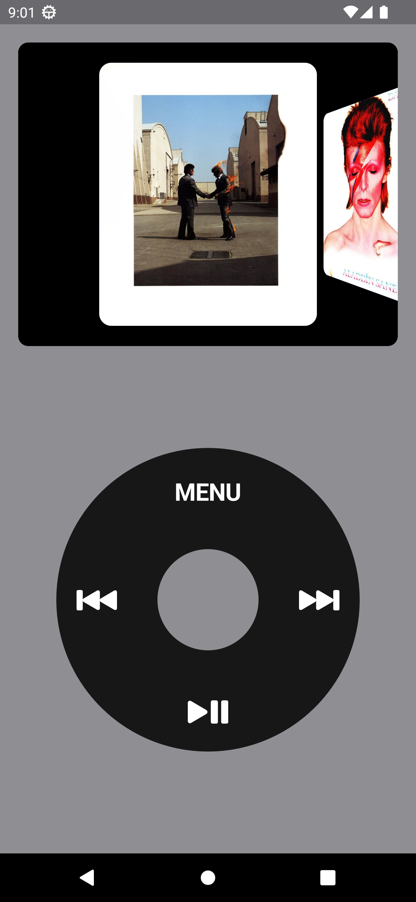

# fPod

The "fPod" project pays homage to the iconic Apple iPod interface, delivering a nostalgic music experience. Developed in Flutter, this mobile application showcases an elegant, minimalist interface that intuitively displays collections of music albums. Navigate through your music library with the same familiar feel as the iPod, explore album covers, and embark on a unique musical journey. With "fPod," we've recreated timeless magic using cutting-edge technology, providing an engaging experience for modern users while celebrating musical heritage. Immerse yourself in the harmony of music with the familiarity of the past, all in the palm of your hand.


## Command to run project in chrome

```
flutter run -d chrome --web-renderer html
```


## ScreenShots

| Image 1 | Image 2 | Image 3 |
|----------|----------|----------|
|  |  |  |


## Coverage

flutter test --coverage

genhtml coverage/lcov.info -o coverage/html

open coverage/html/index.html


## License

MIT License

Copyright (c) 2023 William Franco

Permission is hereby granted, free of charge, to any person obtaining a copy of this software and associated documentation files (the "Software"), to deal in the Software without restriction, including without limitation the rights to use, copy, modify, merge, publish, distribute, sublicense, and/or sell copies of the Software, and to permit persons to whom the Software is furnished to do so, subject to the following conditions:

The above copyright notice and this permission notice shall be included in all copies or substantial portions of the Software.

THE SOFTWARE IS PROVIDED "AS IS", WITHOUT WARRANTY OF ANY KIND, EXPRESS OR IMPLIED, INCLUDING BUT NOT LIMITED TO THE WARRANTIES OF MERCHANTABILITY, FITNESS FOR A PARTICULAR PURPOSE AND NONINFRINGEMENT. IN NO EVENT SHALL THE AUTHORS OR COPYRIGHT HOLDERS BE LIABLE FOR ANY CLAIM, DAMAGES OR OTHER LIABILITY, WHETHER IN AN ACTION OF CONTRACT, TORT OR OTHERWISE, ARISING FROM, OUT OF OR IN CONNECTION WITH THE SOFTWARE OR THE USE OR OTHER DEALINGS IN THE SOFTWARE.
