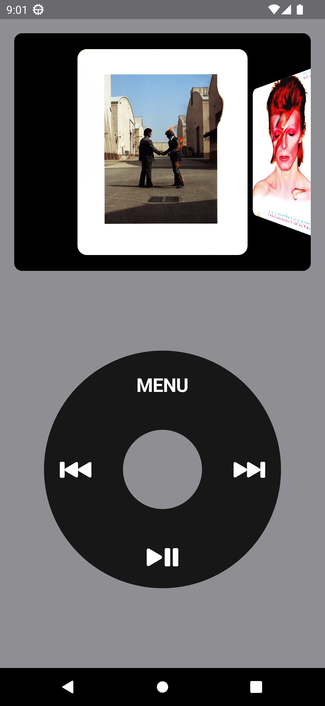
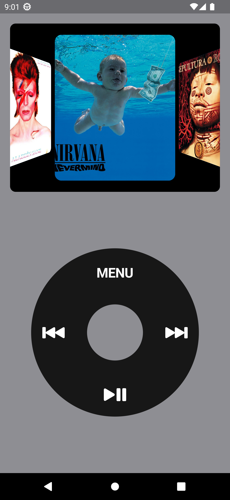
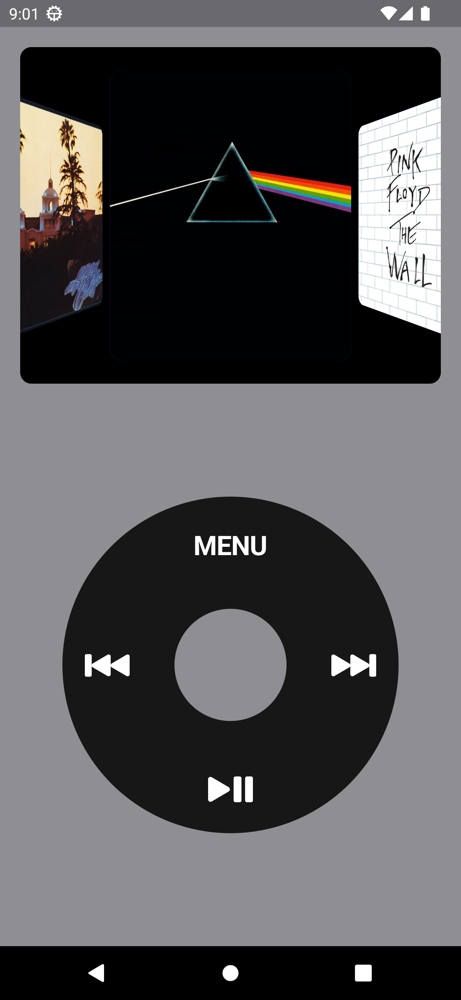

# F Pod

Nostalgic music player inspired by the classic iPod interface, built in Flutter.

Presents album art in a cover-flow style carousel with smooth transforms and minimal chrome.

Based on [flutter-ipod](https://github.com/vishalambre/flutter-ipod); adapted for modular features and shared widgets.

Ideal for studying custom layouts, animations, and asset-driven UI without a backend.

Runs as a self-contained client with local demo content and platform-agnostic rendering.

## Structure


```mermaid
flowchart LR
  PlayerRoute --> PlayerView
  PlayerView --> AlbumCarousel
  AlbumCarousel --> PlayerViewModel
  PlayerViewModel --> AlbumRepository
  AlbumRepository --> LocalAssets[Local assets]
```

## Stack

| Technology | Version |
|------------|---------|
| Dart SDK | ^3.13.3 |
| cupertino_icons | ^1.0.8 |
| get_it | ^9.2.1 |
| go_router | ^17.2.3 |
| flutter_lints | ^6.0.0 |
| build_runner | ^2.15.0 |
| mockito | ^5.6.4 |
| Android Gradle Plugin | 9.1.0 |
| Kotlin | 2.4.0 |
| compileSdk / targetSdk | 36 |
| minSdk | 29 |
| JVM | 25 |
| iOS Deployment Target | 15.0 |
| Swift | 5.0 |

## Architecture

The project is structured in a modular way, where each new functionality should be a new module containing its particularities, and things common to the entire project should be in the `common` module.

```
src/
    ├── common/
    │   ├── constants/
    │   ├── dependency_injectors/
    │   ├── enums/
    │   ├── extensions/
    │   ├── patterns/
    │   ├── routes/
    │   ├── services/
    │   ├── state_management/
    │   └── widgets/
    └── features/
        ├── feature_one/
        │   ├── models/
        │   ├── repositories/
        │   ├── routes/
        │   ├── view_models/
        │   └── views/
        └── feature_two/
            ├── models/
            ├── repositories/
            ├── routes/
            ├── view_models/
            └── views/
```

## Coverage

flutter pub run build_runner build --delete-conflicting-outputs

flutter test --coverage

genhtml coverage/lcov.info -o coverage/html

open coverage/html/index.html

## ScreenShots

| Image 1 | Image 2 | Image 3 |
|----------|----------|----------|
|  |  |  |

## Commits

```
git add . && git commit -m ":rocket: Initial commit." && git push
git add . && git commit -m ":building_construction: Added initial project architecture." && git push
git add . && git commit -m ":building_construction: Update project architecture." && git push
git add . && git commit -m ":memo: Updated project documentation." && git push
git add . && git commit -m ":memo: Updated code documentation." && git push
git add . && git commit -m ":white_check_mark: Added feature xyz." && git push
git add . && git commit -m ":wrench: Fixed xyz usage." && git push
git add . && git commit -m ":heavy_minus_sign: Removed xyz." && git push
git add . && git commit -m ":memo: Adjusted project imports." && git push
git add . && git commit -m ":arrow_up: Updated dependencies." && git push
git add . && git commit -m ":arrow_down: Removed dependencies." && git push
git add . && git commit -m ":wastebasket: Removed unused code." && git push
git add . && git commit -m ":test_tube: Added test functionality xyz." && git push
git add . && git commit -m ":construction_worker: Building in progress." && git push
git add . && git commit -m ":construction_worker: Added CI build system." && git push
```

## License

MIT License

Copyright (c) 2026 William Franco

Permission is hereby granted, free of charge, to any person obtaining a copy
of this software and associated documentation files (the "Software"), to deal
in the Software without restriction, including without limitation the rights
to use, copy, modify, merge, publish, distribute, sublicense, and/or sell
copies of the Software, and to permit persons to whom the Software is
furnished to do so, subject to the following conditions:

The above copyright notice and this permission notice shall be included in all
copies or substantial portions of the Software.

THE SOFTWARE IS PROVIDED "AS IS", WITHOUT WARRANTY OF ANY KIND, EXPRESS OR
IMPLIED, INCLUDING BUT NOT LIMITED TO THE WARRANTIES OF MERCHANTABILITY,
FITNESS FOR A PARTICULAR PURPOSE AND NONINFRINGEMENT. IN NO EVENT SHALL THE
AUTHORS OR COPYRIGHT HOLDERS BE LIABLE FOR ANY CLAIM, DAMAGES OR OTHER
LIABILITY, WHETHER IN AN ACTION OF CONTRACT, TORT OR OTHERWISE, ARISING FROM,
OUT OF OR IN CONNECTION WITH THE SOFTWARE OR THE USE OR OTHER DEALINGS IN THE
SOFTWARE.
