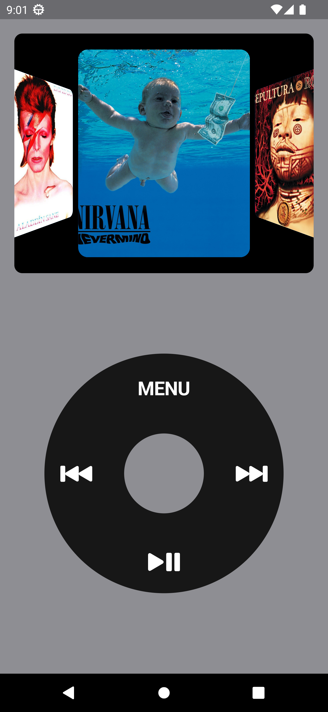
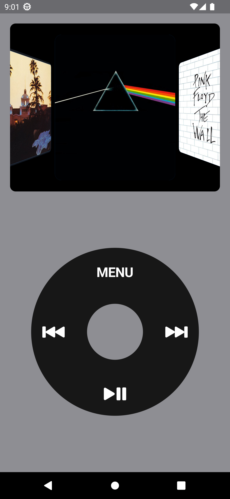

# fPod

The "fPod" project pays homage to the iconic Apple iPod interface, delivering a nostalgic music experience. Developed in Flutter, this mobile application showcases an elegant, minimalist interface that intuitively displays collections of music albums. Navigate through your music library with the same familiar feel as the iPod, explore album covers, and embark on a unique musical journey. With "fPod," we've recreated timeless magic using cutting-edge technology, providing an engaging experience for modern users while celebrating musical heritage. Immerse yourself in the harmony of music with the familiarity of the past, all in the palm of your hand.

This project was created based on this other project: [flutter-ipod](https://github.com/vishalambre/flutter-ipod)


## Directory tree

```
lib/
    └── src/
        ├── common/
        │   ├── constants/
        │   ├── dependency_injectors/
        │   ├── routes/
        │   └── widgets/
        └── features/
            └── music_player/
                ├── controllers/
                ├── models/
                ├── routes/
                ├── views/
                └── widgets/
```


## ScreenShots

| Image 1 | Image 2 | Image 3 |
|----------|----------|----------|
|  |  |  |


## Coverage

flutter test --coverage

genhtml coverage/lcov.info -o coverage/html

open coverage/html/index.html


## Examples of commits

```
git add . && git commit -m ":rocket: Initial commit." && git push
git add . && git commit -m ":building_construction: Added initial project architecture." && git push
git add . && git commit -m ":building_construction: Update project architecture." && git push
git add . && git commit -m ":memo: Updated project documentation." && git push
git add . && git commit -m ":memo: Updated code documentation." && git push
git add . && git commit -m ":white_check_mark: Added feature xyz." && git push
git add . && git commit -m ":wrench: Fixed xyz usage." && git push
git add . && git commit -m ":heavy_minus_sign: Removed xyz." && git push
git add . && git commit -m ":memo: Adjusted project imports." && git push
git add . && git commit -m ":arrow_up: Updated dependencies." && git push
git add . && git commit -m ":arrow_down: Removed dependencies." && git push
git add . && git commit -m ":wastebasket: Removed unused code." && git push
```


## License

MIT License

Copyright (c) 2025 William Franco

Permission is hereby granted, free of charge, to any person obtaining a copy
of this software and associated documentation files (the "Software"), to deal
in the Software without restriction, including without limitation the rights
to use, copy, modify, merge, publish, distribute, sublicense, and/or sell
copies of the Software, and to permit persons to whom the Software is
furnished to do so, subject to the following conditions:

The above copyright notice and this permission notice shall be included in all
copies or substantial portions of the Software.

THE SOFTWARE IS PROVIDED "AS IS", WITHOUT WARRANTY OF ANY KIND, EXPRESS OR
IMPLIED, INCLUDING BUT NOT LIMITED TO THE WARRANTIES OF MERCHANTABILITY,
FITNESS FOR A PARTICULAR PURPOSE AND NONINFRINGEMENT. IN NO EVENT SHALL THE
AUTHORS OR COPYRIGHT HOLDERS BE LIABLE FOR ANY CLAIM, DAMAGES OR OTHER
LIABILITY, WHETHER IN AN ACTION OF CONTRACT, TORT OR OTHERWISE, ARISING FROM,
OUT OF OR IN CONNECTION WITH THE SOFTWARE OR THE USE OR OTHER DEALINGS IN THE
SOFTWARE.

